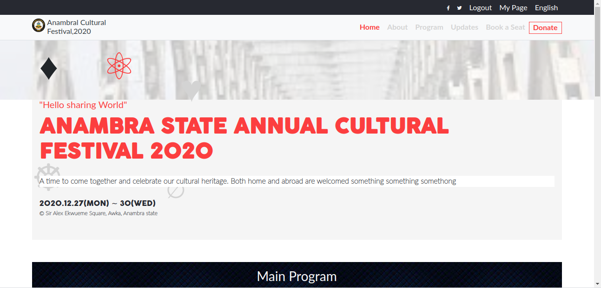

> # Capstone Project
Building a webpage for the HTML/CSS capstone project.

Build a website for Anambra State annual  cultural festival

## Built With

- HTML
- CSS
- Bootstrap

## Live Demo

[Live Demo Link](https://kingobaino1.github.io/Capstone-Project-Annual-Festival/.)

## Author

👤 **Kingsley Ibeh**

- GitHub: [@githubhandle](https://github.com/Kingobaino1)
- Twitter: [@twitterhandle](https://twitter.com/ibehkingso)
- Linkedin: [linkedin](https://www.linkedin.com/in/ibeh-kingsley-obinna-568596177)

## 🤝 Contributing

Contributions, issues, and feature requests are welcome!

Feel free to check the [issues page](https://github.com/Kingobaino1/Capstone-Project-Annual-Festival/issues).

## Show your support

Give a ⭐️ if you like this project!

## Acknowledgments

- [Cindy Shin in Behance](https://www.behance.net/gallery/29845175/CC-Global-Summit-2015)

## 📝 License

This project is [MIT](./LICENSE) licensed.
